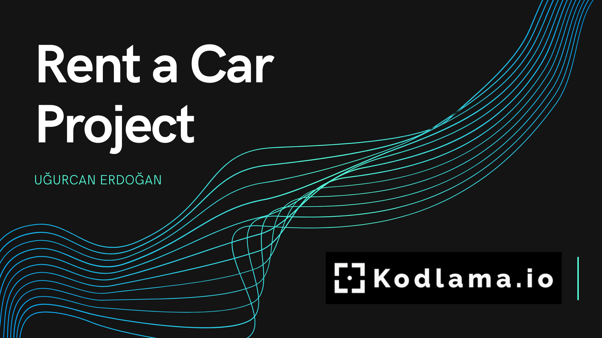
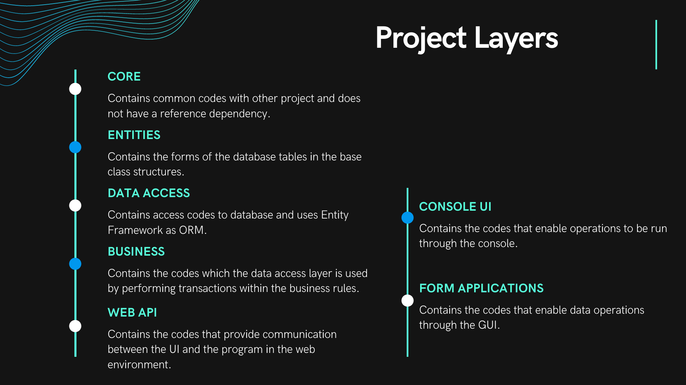
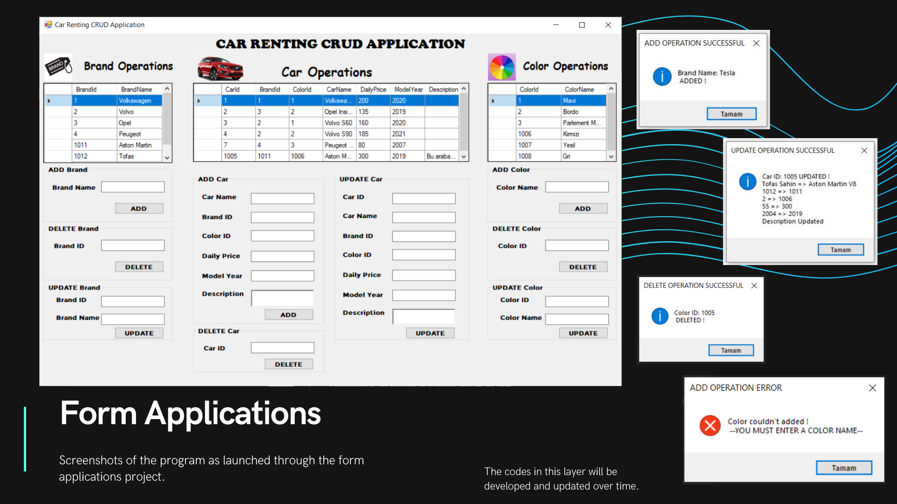

# :car:  Rent A Car Project

	</img>

## :boom: Introduction
- **It is a Car Rental Console project from Entities, DataAccess, Business and Console layers. The project from the Car, Brand, Color tables and their operations will enrich with the front-end over time.**

	</img>

## 	:hammer_and_wrench:  Major Changes

### Commit :triangular_flag_on_post:
- The project was created.
- *LINQ*  Queries added.
- **Business**, **DataAccess**, **Entities** and **ConsoleUI** layers were added.
- Abstract and Concrete classes have been added to the layers.
- New entity **"CAR"** added.
- Operations in *Inmemory*  format added.

### Commit :triangular_flag_on_post:
- **Brand** and **Color** entities added.
- **SQL Server** infrastructure was created(tables) and included in the project.
- **Generic IEntityRepository** infrastructure was added to the system.
- **EntityFramework** infrastructure was established and the system was integrated accordingly.
- GetCarsByBrandId, GetCarsByColorId services added.

### Commit :triangular_flag_on_post:
- **Core** layer was integrated into the system.
- **DTO** structure added.
- Entityframework infrastructure and IEntity part moved to Core layer.

### Commit :triangular_flag_on_post:
- **Result** configurations added.
- System Messages called **Constants** were integrated and the project was made compatible.
- Rental, Customer,User entities added. Their infrastructure was integrated.
- Additional DTOs were added.
- **WebAPI** layer was established. API equivalent of all services in *business* layer was added.
- Tested on **POSTMAN**. 

### Commit :triangular_flag_on_post:
- The missing layer **CORE** was added.
- **Form applications** layer was added. Various business rules have been coded.
- Readme has been updated with visuals. 
- *FileHelper* added. Now we can add **Car Images** at most 5 per each car. 

	</img>

------------
###  :gear: USED TOOLS

   

------------

> This project is progressing with the assignments given in line with the main project of kodlama.io camp.

##### MAIN PROJECT : https://github.com/ugurcanerdogan/Csharp-Projects

------------

###### :black_nib: : Uğurcan ERDOĞAN
###### ✅ License : GNU
